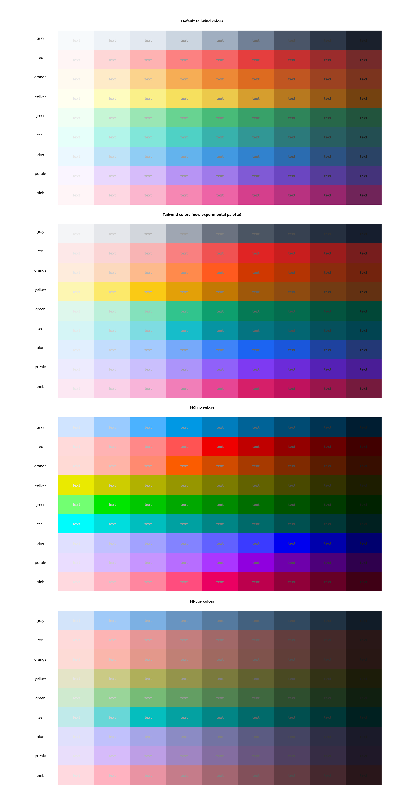

# HSLuv/HPLuv color space for TailwindCSS

This package is made to experiment with the HSLuv/HPLuv color space which should be better for UI design. It's technically just a helper function which using the [hsluv](https://github.com/hsluv/hsluv/tree/master/javascript) library to generate the color variants for [TailwindCSS](https://tailwindcss.com/).


## Why?

[Steve Schoger](https://twitter.com/steveschoger) made a beautiful color palette in TailwindCSS, **but**: 

- you can't trust in the lightness variations. Even if the colors are hand-picked, if you use bg-blue-300 and bg-yellow-300 the perceived lightness will be different.
- the steps between the lightness variations sometimes not even


## How then?

The difference between **HSL** and **HSLuv**/**HPLuv**/**CIELUV** color spaces is the lightness value based on the human eye instead of how the monitor mixing the colors. With **HSLuv** we can generate the color variations based on the perceived lightness.

You can read about these here:
* [HSLuv comparsion to HSL](https://www.hsluv.org/comparison/)
* [Perceptually uniform color spaces](https://programmingdesignsystems.com/color/perceptually-uniform-color-spaces/)


## Credits

The HSLuv library made by [Alexei Boronine](https://www.boronine.com/)

The Color name list came from the [Name that color](http://chir.ag/projects/name-that-color/) library


## Install

```bash
npm i tailwind-hsluv
# or
yarn add tailwind-hsluv
```


## Color names

The `generateColors` function accepts colors as string in two possible format: 

* hex color (#RRGGBB) 
* or a named color like "Eastern Blue" or "Seaweed", etc. 

The color name lookup is case-insensitive. You can find the color names in the [source](./src/color-names.js) or you can pick one via the [Name that color](http://chir.ag/projects/name-that-color/) website.


## API

`generateColors(colorMap, options)`: generates the colors for TailwindCSS.

**Options:**

| name  | default | description                        |
| ----- | ------- | ---------------------------------- |
| step  | `100`   | steps between the lightness values |
| hpluv | `false` | use a HPLuv color space            |

**Full example:**

```javascript
// tailwind.config.js
const { generateColors } = require('tailwind-hsluv');

module.exports = {
    theme: {
        extend: {
            colors: generateColors({
                superred: '#ff0000', // 6 digit hex color
                grayscale: '#ccc', /// 3 digit hex color
                blue: [0, 0, 255], // rgb array
                green: 'green', // simple named color
                mypurple: 'Jacksons Purple' // specific named color
            }, {
                step: 100, // steps between lightness variants, default: 100
                hpluv: false // use the HPLuv color space, default: false
            })
        }
    }
};
```


## Comparison between the color palettes

The "text" texts are colored with grayscale `hsl(0, 0%, 10%-90%)` and each of the boxes have a background color lightness variant from 100 to 900.

If the text lightness is closer to the background color lightness you less likely can see the difference between them.



